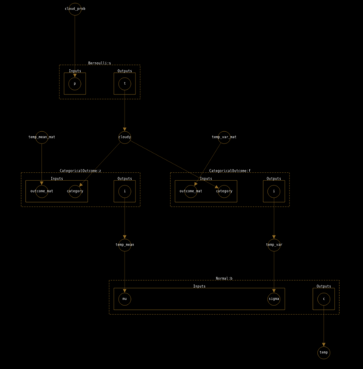

# Syllog

An interface and library for visual probabilistic programming.
Currently being converted from an early prototype to beta architecture.
Syllog targets the following workflow:

1. Author model in visual PGM environment 
2. Export model to JSON format
3. Load model into probabilistic programming library and perform inference

The final step can be performed manually, using hand-coded factor definitions;
or in a single shot, using a library of predefined, named factor functions.



Syllog follows in the tradition of tools like Tetrad,
but targets modern libraries and contemporary inference methods (including SVI).
In addition, it is a web-based tool appropriate for teaching and academic use.

# Requirements:
- Python: PyTorch, igraph
- Javascript: webpack, babel, cytoscape, various cytoscape plugins (see `web/package.json`),
various linting and formatting plugins (for development)

# Use (legacy webapp)
- Use `yarn` to install dependencies
- Use `npx webpack` in `web` to build the editor 
- Serve `web/index.html` or similar page from a webserver - `cd web; python -m http.server` works well.
- Export model to `.json` file and load with Python classes. See `/notebooks` for examples.

# Use (react app)
- Use `yarn` to install dependencies
- Use `yarn start` to serve the app
- Export model to `.json` file and load with Python classes. See `/notebooks` for examples.

# Data formatting
There are currently two data formats for Syllog, each JSON-based.

## CyJSON
The first is called "CyJSON". It is a subset of the JSON accepted by CytoscapeJS to construct elements,
with some additional constraints to guarantee correct factor graph structure.

It has the structure

```javascript
{
  "nodes": [{
    "data": {
      "id": "some-uuid-value",
      "name": "a human-readable name",
      "type": "NODE_TYPE_FROM_ENUM",
      ...otherProperties,
    },
    ...otherNodes
  }], 
  "edges": [{
    "data": {
      "id": "some-uuid-value",
      "source": "some-nodes-id",
      "target": "another-nodes-id",
    },
    ...otherNodes
  }]
}
```

Each node in the factor graph is a variable, a factor, a factor input, or a factor output.

The "data" key of each element type is described below:

### Variables
```javascript
{
  "id": "some-unique-uuid",
  "name": "some-unique-name",
  "type": "VARIABLE",
  "variableType": "VARIABLE_TYPE_FROM_ENUM",
}
```

- `"name"` must be unique within the scope of all variable and factor names.
- `"variableType"` must be one of `["LATENT", "EVIDENCE", "QUERY"]`.

Latent nodes will be marginalized out. 
Evidence nodes will be conditioned over.
Query nodes will be computed. 

### Factors
```javascript
{
  "id": "some-unique-uuid",
  "name": "some-unique-name",
  "type": "FACTOR",
  "factorFunction": "factorFunctionName",
}
```

`"name"` must be unique within the scope of all variable and factor names.
`"factorFunction"` is the name of a (possibly stochastic) function that will be used to compute this factor.

### Factor Inputs and Outputs

```javascript
{
  "id": "some-unique-uuid",
  "name": "some-unique-name",
  "type": "FACTOR_CHILD_TYPE",
  "factor": "some-factor-id",
  "parent": "some-factor-container-id",
}
```

`"name"` must be unique within the scope of this factor's inputs and outputs.
`"type"` must be one of `["FACTOR_INPUT", "FACTOR_OUTPUT"]`
`"factor"` must be the id of the factor in the graph that this input or output corresponds to.

In general, all factors with a given factor function should
have the same set of names for inputs and outputs.
E.g., every Normal distribution factor will have two inputs named "sigma" and "mu" and one output named "Z".

### Factor Containers

In addition to the input and output nodes, each factor is augmented with input and output container nodes.
These are for internal use by Syllog for layout only, and can be ignored by most applications.

```javascript
{
  "id": "some-unique-uuid",
  "parent": "some-factor-id",
  "type": "FACTOR_CONTAINER_TYPE",
}
```
`"parent"` must be the id of the factor in the graph that this container corresponds to.
`"type"` must be one of `["FACTOR_INPUT_CONTAINER", "FACTOR_OUTPUT_CONTAINER"]`.

It is expected that these nodes will be removed soon.

### Edges
```javascript
{
  "id": "some-unique-uuid",
  "source": "some-node-id",
  "target": "some-other-node-id",
}
```

Edges are specified for all connections between factor inputs, factor outputs, and variables.
Note that edges are only valid from a factor output to a variable, and from a variable to a factor input.
Furthermore, a variable or factor input may only have one incoming edge.
Variables and factor outputs may have several outgoing edges (though this is redundant in the latter case).

Reader applications are responsible for inferring the correct edges between factors and their input and output nodes. Each input node is connected to the factor node, and each factor node is connected to the output nodes for that factor.
It is expected that the need for this inference will be removed soon.

## FactorJSON

The second data format is the specification of factor functions.
The data has the structure 

```javascript
{
  "functionName": {
    "inputs": ["input1", "input2", ...moreInputs],
    "outputs": ["output1", ...moreOutputs]
  },
  ...moreFactors
}
```

The first item in the above object describes a factor function
named `functionName`
which receives the named arguments `input1, input2, ...`
and returns a map of named outputs `output1, ...`.

# Progress

Todo for 0.0.1: 
- [x] Import/export JSON
- [x] Enforce unique variable names
- [x] Scope variable names to factors (e.g. to allow for many factors with theta, sigma, etc as inputs)
- [x] Generate variable names
- [x] Variable namer
- [x] Radial marking menus
- [x] Allow orphaned nodes 
- [ ] Save/load JSON flat file
- [x] Pyro support
- [x] Predefined factors (distributions, arithmetic, etc)
- [ ] Factor definition JSON spec
- [ ] Copy factors in editor
- [ ] Library of predefined factors for Pyro
- [ ] Insert factor from library
- [ ] Evidence/latent/target handling for Pyro 
- [ ] Export LaTeX graph

Roadmap:
- [ ] Validate before export
- [ ] Transformer nodes (deterministic transforms for data)
- [ ] Swap between factor/DGM view
- [ ] Factor layout rules
- [ ] Nested marking menus
- [ ] D-separation preview
- [ ] LaTeX text rendering
- [ ] Evidence/latent/target handling
- [ ] Example models
- [ ] Plates
- [ ] UGM models?
- [ ] Code gen for Pyro ("Eject" from SyllogModel)
- [ ] Support for probabilistic programming libraries beyond Pyro (Edwin, Stan, etc)

