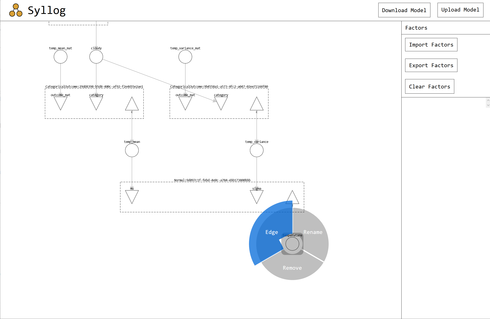
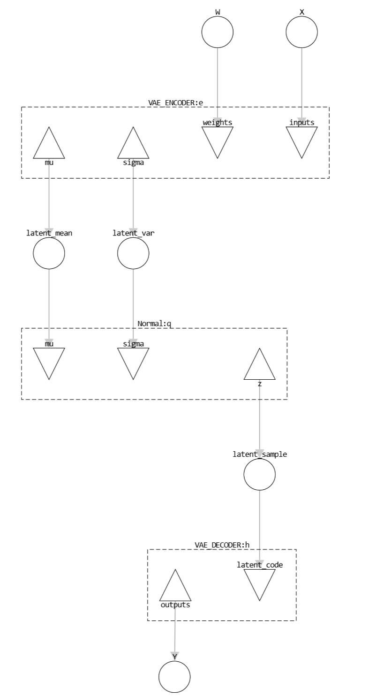

# Syllog

Syllog is an interface and library for visual probabilistic programming, targeting the following workflow:

1. Author model in visual PGM environment 
2. Export model to JSON format
3. Load model into probabilistic programming library and perform inference

The final step can be performed manually, using hand-coded factor definitions;
or in a single shot, using a library of predefined, named factor functions.

Currently, Syllog consists of a webapp for model authoring, and a Python module that runs Syllog models in Pyro
(support for libraries beyond Pyro is a potential roadmap item).

Syllog follows in the tradition of tools like Tetrad,
but targets modern libraries and contemporary inference methods (including SVI libraries).
In addition, the authoring component is a flexible, web-based tool ideal for teaching and academic use.

Syllog is in an early beta phase.
It is very important to me that potential users are able to provide input and influence the direction of the project.
Please get in touch with me (my email is my Github profile) or file issues here if you find any bugs, have any feedback or roadmap input, or would like to contribute to this project.

# Using the authoring environment



You can visit the webapp at [wgoldie.github.io/syllog](http://wgoldie.github.io/syllog) or build/serve it yourself (see below).

## Directed Factor Graphs

The authoring environment allows directed factor graphs to be created and exported.
These are essentially directed graphical models that encode the relevant probability distributions explicitly in factors.
Note that directed factor graphs are still DAGs, and not equivalent to undirected factor graph models (though Syllog may support those in the future).]
Obtaining a directed factor graph from a traditional DGM is trivial: 
one should place a factor above each node and connect each of the node's parents to that factor. 
The original parents should then be disconnected from the node.

Directed factor graphs as implemented by Syllog have slightly greater expressive power than traditional DGMs,
because the factors may each have several ouputs.
For instance, in the case of a multivariate Gaussian, each output dimension could be output to a separate node.
In another application, we could present a VAE model that samples latent codes using a Gaussian approximating distribution *q* as the model below:



Note that the factor for the encoder has multiple children, but it is clear that the same stochastic function (which might be a feedforward network, in this case) generated both the mean and variance for the variational approximation. In a traditional DGM, we would simply see edges from the encoder parameter node to each of the variational parameter nodes, and edges from the encoder input node to each of the variational parameter nodes.

Syllog's models are designed to explicitly encode this kind of computational (in)dependence property, in addition to the statistical independence properties expressed by graphical models in general. This encoding helps bridge the gap between theoretical analysis of a model and the concrete implementation of it.

Syllog's factor graphs consist of variables (circles), factors (boxes), factor inputs (downward-pointing triangles), and factor outputs (upward-pointing triangles).

Before authoring, you should load up a library of factor definitions (see `/factors/pyro/factors.json` for an example library).
You can create factors by inserting them from the Factors pane on the right (using the "Add" button on each factor definition),
or through the edit menu.

The edit menu is a contextual menu that can be triggered on any object in the graph by right clicking. 
By opening the edit menu on the background, you can add factors and variables, or trigger a relayout of the graph.

Opening the edit menu on a variable will allow you to remove the node, rename the node, or draw an edge to a factor input or output. 

Opening the edit menu on a factor input or output will allow similar actions, but with edges possible only to variables.

Finally, opening the edit menu on a factor will let you add inputs or outputs, and choose the function (distribution) used to sample this factor.
Renaming or deleting the factor is also possible.
Note that each factor in your graph with the same function name should have the same set of inputs or outputs.

You can export or import your model using the header buttons for this purpose. Note that uploading will wipe out your current work.

# Using the Python module(s)
Check out the `notebooks/` directory for in-depth walkthroughs of how to use exported Syllog models with Pyro.

# Requirements:
- Python: PyTorch, igraph, PyTorch, Pyro, Cairo (optional, for plotting)
- Javascript: Webpack, babel, React, Cytoscape.JS, various cytoscape plugins (see `web/package.json`),
various linting and formatting plugins (for development)

# Building and serving the webapp 
- `cd` to `web` from the project root.
- Modify `homepage` in `package.json` as desired.
- Use `yarn` to install dependencies
- Use `yarn start` to serve the app
- Export model to `.json` file and load with Python classes. See `/notebooks` for examples.

# Data formatting
There are currently two data formats used by Syllog, each JSON-based.

## CyJSON
The first format is called "CyJSON". It is a subset of the JSON accepted by CytoscapeJS to construct elements,
with some additional constraints to guarantee correct factor graph structure.

It has the structure

```javascript
{
  "nodes": [{
    "data": {
      "id": "some-uuid-value",
      "name": "a human-readable name",
      "type": "NODE_TYPE_FROM_ENUM",
      ...otherProperties,
    },
    ...otherNodes
  }], 
  "edges": [{
    "data": {
      "id": "some-uuid-value",
      "source": "some-nodes-id",
      "target": "another-nodes-id",
    },
    ...otherNodes
  }]
}
```

Each node in the factor graph is a variable, a factor, a factor input, or a factor output.

The "data" key of each element type is described below:

### Variables
```javascript
{
  "id": "some-unique-uuid",
  "name": "some-unique-name",
  "type": "VARIABLE",
  "variableType": "VARIABLE_TYPE_FROM_ENUM",
}
```

- `"name"` must be unique within the scope of all variable and factor names.
- `"variableType"` must be one of `["LATENT", "EVIDENCE", "QUERY"]`.

Latent nodes are marked for marginalizing out. 

Evidence nodes are marked for conditioning over.

Query nodes are marked for targeted computation (by marginalizing and conditioning the nodes that are D-connected to these). 

### Factors
```javascript
{
  "id": "some-unique-uuid",
  "name": "some-unique-name",
  "type": "FACTOR",
  "factorFunction": "factorFunctionName",
}
```

- `"name"` must be unique within the scope of all variable and factor names.
- `"factorFunction"` is the name of a (possibly stochastic) function that will be used to compute this factor.

### Factor Inputs and Outputs

```javascript
{
  "id": "some-unique-uuid",
  "name": "some-unique-name",
  "type": "FACTOR_CHILD_TYPE",
  "parent": "some-factor-id",
}
```

- `"name"` must be unique within the scope of this factor's inputs and outputs.
- `"type"` must be one of `["FACTOR_INPUT", "FACTOR_OUTPUT"]`
- `"parent"` must be the id of the factor in the graph that this input or output corresponds to.

In general, all factors with a given factor function should
have the same set of names for inputs and outputs.
E.g., every Normal distribution factor will have two inputs named "sigma" and "mu" and one output named "Z".

### Edges
```javascript
{
  "id": "some-unique-uuid",
  "source": "some-node-id",
  "target": "some-other-node-id",
}
```

Edges are specified for all connections between factor inputs, factor outputs, and variables.
Note that edges are only valid from a factor output to a variable, and from a variable to a factor input.
Furthermore, a variable or factor input may only have one incoming edge.
Variables and factor outputs may have several outgoing edges (though this is redundant in the latter case).

Reader applications are responsible for inferring the correct edges between factors and their input and output nodes. Each input node is connected to the factor node, and each factor node is connected to the output nodes for that factor.
It is expected that the need for this inference will be removed soon.

## FactorJSON

The second data format is the specification of factor functions.
The data has the structure 

```javascript
{
  "functionName": {
    "inputs": ["input1", "input2", ...moreInputs],
    "outputs": ["output1", ...moreOutputs]
  },
  ...moreFactors
}
```

The first item in the above object describes a factor function
named `functionName`
which receives the named arguments `input1, input2, ...`
and returns a map of named outputs `output1, ...`.

# Roadmap 

- [ ] Filename picker for save
- [ ] Enforce input/output homogenity over factors with the same function 
- [ ] Validate model before export
- [ ] Decompose SyllogPyroModel into SyllogModel and SyllogPyroModel
- [ ] Evidence/latent/target handling for Pyro 
- [ ] Support for other libraries
- [ ] Deterministic nodes (deterministic transforms for data)
- [ ] Copy factors in editor
- [ ] Swap between factor/DGM view
- [ ] Factor layout rules
- [ ] Nested marking menus
- [ ] D-separation preview
- [ ] LaTeX text rendering
- [ ] Evidence/latent/target handling
- [x] Example models
- [ ] Plates
- [ ] UGM models?
- [ ] Code gen for Pyro ("Eject" from SyllogModel)
- [ ] Support for probabilistic programming libraries beyond Pyro (Edwin, Stan, etc)
- [WIP] Export LaTeX graph
- [ ] Namespacing for factor functions
- [ ] Custom Cytoscape layout algorithm 
- [ ] Compile Python libraries to webassembly or similar to demo inference in-browser
- [ ] Live modelling-inference loop with local or cloud webserver
- [ ] Notes field for model, factor definitions

